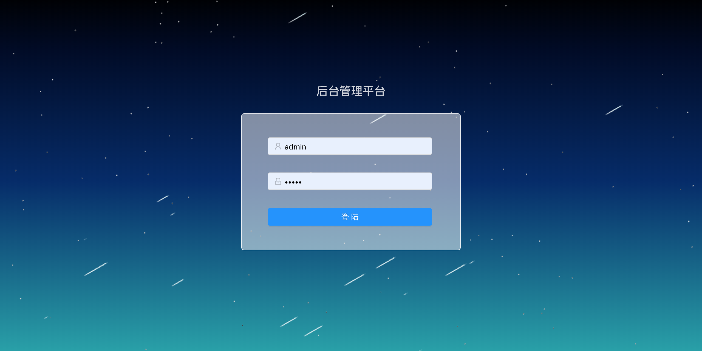
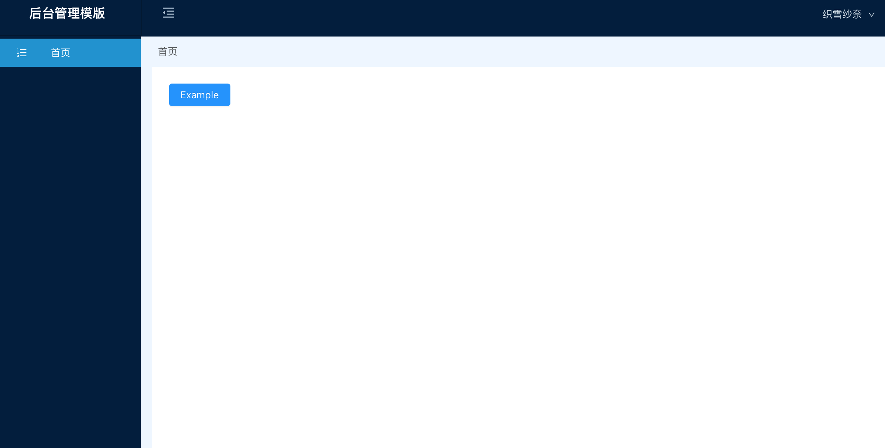

# react-admin-app



Small and simple react-admin template, look pretty, more free and more faster for development

## Dependencies
+ react 
+ react-router
+ axios
+ antd
+ @babel/core
+ react-loadable
+ less-loader

## Character
+ Fewer configuration 
+ Tmplate and less code for you

## Compared
+ no need redux for little small project
+ almost all the npm packages is the latest version


Ensure you have [Node.js](https://nodejs.org) version 8 or higher installed. Then run the following:
### Install
```
npm install react-admin-app -g 
```


### Usage
```
$ react-admin-app --help
  Usage
    $ react-admin-app [projectName]

  Examples
    $ react-admin-app  my-admin
```

### Donate
微信


## License

MIT © [Carrie999](https://github.com/Carrie999)
